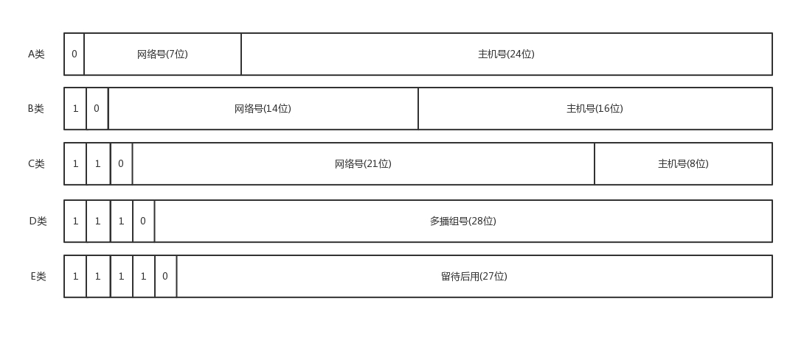
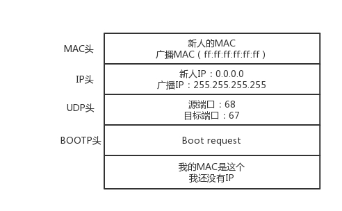

[TOC]

# 网络协议

## 1.IP地址类型



### IP地址范围


## 2.无类型域间选路(CIDR)

1. 为了解决各类型IP地址同网段最大主机数不是太小就是太大而出现，可以选定网络号的位数;
2. e.g:`10.100.122.2/24`表示地址中有24位是网络号，剩余8位为主机号;
3. 广播地址：`10.100.122.255`如果发送这个地址，所有`10.100.122`网络里的主机都可以收到;
4. 子网掩码：`255.255.255.0`子网掩码与IP地址进行&计算，可以得到网络号;

## 3.ip addr命令输出解释

```shell
1: lo: <LOOPBACK,UP,LOWER_UP> mtu 65536 qdisc noqueue state UNKNOWN group default qlen 1000
    link/loopback 00:00:00:00:00:00 brd 00:00:00:00:00:00
    inet 127.0.0.1/8 scope host lo
       valid_lft forever preferred_lft forever
    inet6 ::1/128 scope host 
       valid_lft forever preferred_lft forever
2: ens32: <BROADCAST,MULTICAST,UP,LOWER_UP> mtu 1500 qdisc pfifo_fast state UP group default qlen 1000
    link/ether 00:0c:29:4a:fd:92 brd ff:ff:ff:ff:ff:ff
    inet 192.168.79.130/24 brd 192.168.79.255 scope global noprefixroute ens32
       valid_lft forever preferred_lft forever
    inet6 fe80::a0f3:3bf7:dd68:1769/64 scope link noprefixroute 
       valid_lft forever preferred_lft forever
```

1. IP地址后面`scope`为`global`表示网卡可以对外接收来自任何地方的包;
2. lo网卡的`scope`为`host`一般分配127.0.0.1，是本机通信地址，内核处理后会直接返回;
3. `link/ether 00:0c:29:4a:fd:92 brd ff:ff:ff:ff:ff:ff`IP地址的上一行`link/ether`后为MAC地址，用6个2个一组的16进制数表示(6byte);
4. `<BROADCAST,MULTICAST,UP,LOWER_UP>`称为`net_device flags`是网络设备的状态标识;

5. `BROADCAST`表示这个网卡有广播地址，可以发送广播包;

6. `MULTICAST`表示这个网卡可以发送多播包;

7. `LOWER_UP`表示L1是启动的，即网线是插着的;

8. `mtu 1500`表示最大传输单元为1500byte，是以太网的默认值;`mtu`是第二层MAC层的概念，以太网规定MAC正文不能超过1500byte。MAC正文包括IP头、TCP头、HTTP头，如果放不下就要分片传输;
9. `qdisc`全名`queueing discipline`称为排队规则，内核如果需要通过该接口发送数据包，需要按照这个接口提供的qdisc把数据包加入队列;

* `pfifo`是最简单的qdisc，不对数据包进行任何处理，采用先入先出的方式;
* `pfifo_fast`将队列分成3个band,每个band采用pfifo的方式，band0优先级最高，当band0里有数据包存在时，不会处理band1里的数据包;
* 数据包按照`TOS`即`Type Of Service`被分至三个band里，TOS是IP头里的一个字段;

## 4.IP与MAC

1. IP由指定机构分配，具有远程定位功能;
2. MAC在同一子网内(网络号相同)具有定位功能;
3. IP如同地址，MAC如同身份证;

## 5.DHCP动态主机配置协议

1. `DHCP Discover`：新机器使用IP地址0.0.0.0发送一个广播包，目的IP地址为255.255.255.255;广播包封装了UDP，UDP封装了BOOP，DHCP是BOOP的增强版;



2. `DHCP Offer`：DHCP Server判断MAC是否唯一，发送广播包分配IP并为其保留;广播包包括子网掩码、网关、IP地址租用期等;


3. 如果有多个DHCP服务器，新机器会获得多个DHCP Offer;一般将选择最先收到的，然后向网络发送一个DHCP Request广播数据包，其中包括自己的MAC地址、接受租约中的IP地址、提供此租约的DHCP服务器地址等，并告诉所有DHCP服务器将采用哪个服务器提供的IP，请求其他服务器撤销他们提供的IP，以便提供给下一个租用者;(此时仍然使用0.0.0.0)


4. 当DHCP Server收到客户机的DHCP Request以后，会广播给客户机(0.0.0.0）一个`DHCP ACK`消息包表示接受客户机的选择，并将IP地址的合法租用信息和其他配置信息放入广播包，一起发送给客户机;